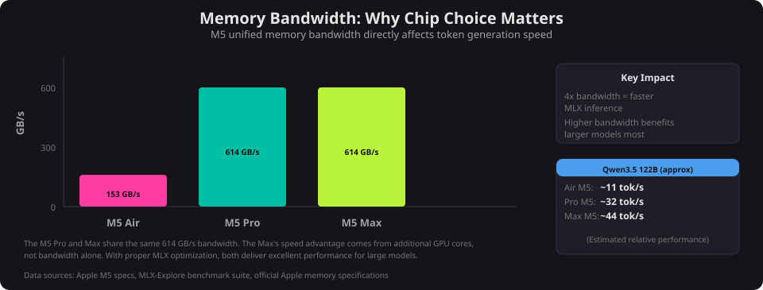
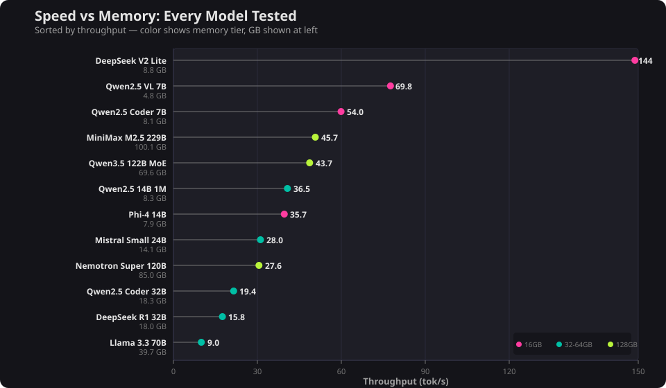
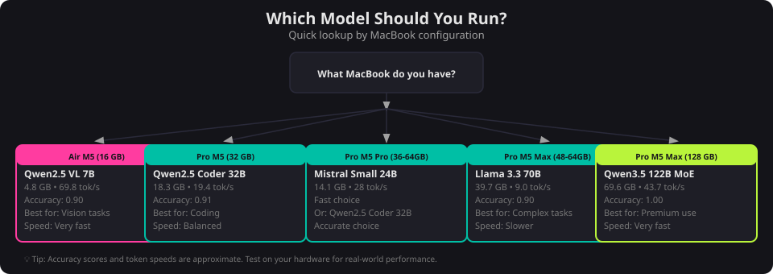
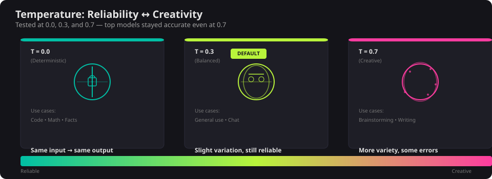

The 2026 M5 MacBook lineup spans three practical memory tiers for local LLMs: 16 GB, 32–64 GB, and 128 GB. Each tier opens up a different class of model. Since models load entirely into unified memory, the math is simple — subtract what your OS and apps need, and whatever's left is your model budget.

**Reserve at least 8 GB for macOS and light apps.** If you're running an IDE, a browser with a dozen tabs, and Slack, budget closer to 16 GB. Memory bandwidth also matters — the M5 Max delivers 614 GB/s (4x the MacBook Air's 153 GB/s), which means noticeably faster token generation, especially with MLX models. The [full benchmark data](/projects/m5-macbook-benchmark-pipeline) has per-category scores, format comparisons, and the exact prompts used.

**Note:** All benchmarks were run on a single MacBook Pro M5 Max with 128 GB of unified memory. Performance figures for the M5 Air (16 GB) and M5 Pro (32–64 GB) tiers are estimates based on relative specs between chips — primarily memory bandwidth and GPU core counts. Your real-world results will vary.

Set it up

## Setup guide

### LM Studio

All models in this post were tested with [LM Studio](https://lmstudio.ai), a desktop app for running local LLMs on macOS, Windows, and Linux. Download it, open it, and search for any model by name — it handles downloading, quantization format selection, and GPU offloading automatically. No terminal required. LM Studio also exposes an OpenAI-compatible API at `localhost:1234`, so anything that talks to the OpenAI API (scripts, VS Code extensions, other apps) can use your local model as a drop-in replacement. To set the context length, open the model settings panel before loading.

Here are the top picks per tier, pulled from over 2,400 scored prompt runs across 14 models. The [full methodology and raw data](/projects/m5-macbook-benchmark-pipeline) are in the project writeup.

| Your MacBook | Model to Run | Format | GB | tok/s | Accuracy |
|-------------|-------------|--------|-----|-------|----------|
| 16 GB (Air/Pro M5) | Qwen2.5 VL 7B | GGUF Q4_K_M | 4.8 | 69.8 | 0.90 |
| 32–64 GB (best accuracy) | Qwen2.5 Coder 32B | MLX 4-bit | 18.3 | 19.4 | 0.91 |
| 32–64 GB (best speed) | Mistral Small 24B | MLX 4-bit | 14.1 | 28.0 | 0.88 |
| 48–64 GB (step up) | Llama 3.3 70B | MLX 4-bit | 39.7 | 9.0 | 0.90 |
| 128 GB (Pro M5 Max) | Qwen3.5 122B MoE | MLX 4-bit | 69.6 | 43.7 | 1.00 |

### GGUF vs MLX

Try MLX first if your model has both formats — it was faster for 6 of 11 models tested, with speedups up to 38% on higher-bandwidth chips. Switch to GGUF if it feels slow, especially on a MacBook Air where the lower bandwidth can flip the advantage. A few specifics:

- **GGUF was faster for 5 of 11 models** — Qwen2.5 VL 7B ran 45% faster in GGUF.
- **Accuracy differences were minimal** — within 1–3% for the same model.
- **GGUF has wider availability.** Not every model has an MLX version.

Pick your model

## 16–24 GB: <7B models

**If you have 16 GB** — with ~6–8 GB available for a model after the OS, you're limited to 7B-class models — but the best ones in this range are surprisingly capable.

**Top pick: Qwen2.5 VL 7B** (GGUF Q4_K_M, 4.8 GB) — 69.8 tok/s, 0.90 accuracy

This was the efficiency champion of the entire benchmark. At 4.8 GB it fits comfortably in 16 GB with room to spare, runs at nearly 70 tokens per second, and matched the accuracy of models 3–8x its size. It scored 0.90 on the rubric — the same as Mistral Small 24B, which needs 13.5 GB.

**For code:** Qwen2.5 Coder 7B (MLX 8-bit, 8.1 GB) — 54 tok/s, 0.83 accuracy. Tight fit on 16 GB but doable if you close other apps. DeepSeek Coder V2 Lite (8.8 GB) is even faster at 127–144 tok/s but scored lower at 0.82–0.85.

**Also fits:** Phi-4 14B (GGUF Q4_K_M, 7.9 GB) — 35.7 tok/s, 0.88 accuracy. A strong all-rounder if you can spare the extra 3 GB over Qwen2.5 VL 7B, though it's half the speed.

## 32–64 GB: <70B models

**If you have 32–64 GB** — with ~18–48 GB available for a model depending on your spec, the 24B and 32B models are the workhorses — and on the higher end, Llama 3.3 70B becomes an option.

**Top pick: Qwen2.5 Coder 32B** (MLX 4-bit, 18.3 GB) — 19.4 tok/s, 0.91 accuracy

The highest accuracy in this tier at 0.91. Despite the "Coder" name, it performed well across all categories including math and factual knowledge. Fits comfortably on any machine in this range. MLX-only — no GGUF variant was tested.

**Best reasoning: DeepSeek R1 32B** (GGUF Q4_K_M, 18.0 GB) — 15.8 tok/s, 0.88 accuracy (GGUF) / 0.91 (MLX)

A reasoning model that thinks through problems in `<think>` blocks before answering. Slower but more careful. The MLX variant (18.4 GB) scored higher at 0.91 but ran slightly slower at 12.5 tok/s.

**Fastest at this tier: Mistral Small 24B** (GGUF Q4_K_M, 13.5 GB) — 22.4 tok/s, 0.90 accuracy

Leaves plenty of headroom for other apps, runs faster than both 32B models, and matches them on accuracy. The practical choice if you multitask heavily. MLX variant (14.1 GB) bumps throughput to 28 tok/s.

**Budget option: Qwen2.5 14B 1M** (GGUF Q4_K_M, 8.3 GB) — 36.5 tok/s, 0.88 accuracy

Half the size of the 32B models at nearly the same accuracy, and supports up to 1M token context (though speed degrades well before that limit). Great if you want to keep most of your memory free.

**If you have 48–64 GB: Llama 3.3 70B** (MLX 4-bit, 39.7 GB) — 9.0 tok/s, 0.90 accuracy

The largest dense (non-MoE) model tested. Solid accuracy but notably slow — 9 tok/s means you'll be waiting. The GGUF variant is even slower at 7.5 tok/s. Only practical on 48 GB or higher configs where you can spare 40 GB and still have room for your OS and apps. At 9 tok/s on the M5 Max, expect even slower throughput on the M5 Pro where lower bandwidth is the bottleneck.

**A note on the gap:** There's a real gap in available models between ~20 GB and ~40 GB. The 32B-class models top out around 18 GB, and the next meaningful step up is Llama 3.3 70B at 40 GB. Models like Qwen3 30B-A3B MoE (~17 GB) and Qwen3 32B (~19 GB) are promising newer releases in this space but weren't part of this benchmark — they're worth testing if you want to make the most of a 48 or 64 GB machine. This is an area I plan to expand in a future round of benchmarks.

## 128 GB: 120B+ models

**If you have 128 GB** — with ~104–112 GB available, you can run the largest open-weight models available today — up to 229 billion parameters. Combined with the M5 Max's 614 GB/s memory bandwidth, this is the best local LLM experience you can get on a laptop.

**Top pick: Qwen3.5 122B MoE** (MLX 4-bit, 69.6 GB) — 43.7 tok/s, 1.00 accuracy

The only model to score a perfect 1.00 rubric average — flawless across math, code, factual knowledge, and instruction following. As a mixture-of-experts model it's faster than its parameter count suggests. The GGUF variant (73.5 GB, 31.7 tok/s) also scored 1.00 but MLX is 38% faster. Leaves ~40 GB free — enough to run an IDE and browser alongside it.

**Runner-up: Nemotron Super ~120B** (GGUF Q4_K_M, 85.0 GB) — 27.6 tok/s, 0.98 accuracy

GGUF-only (no MLX variant available). Strong across all categories, especially math. Uses more memory than Qwen3.5 for slightly lower accuracy, so it's the second choice unless you have a specific preference.

**Maximum capability: MiniMax M2.5 229B** (MLX 3-bit, 100.1 GB) — 45.7 tok/s, 0.98 accuracy

The largest model tested — 229 billion parameters running locally on a laptop. At 100 GB it leaves only ~12 GB for the OS, so close everything else. Despite its size, it runs at 45.7 tok/s in MLX — faster than many 32B models. The GGUF variant (101 GB, 38.3 tok/s) also scored 0.98.

Tune it

## Model tuning

### Context windows

Context length controls how much of your conversation or document the model can "see" at once. Larger windows cost more memory and can reduce throughput.

**For most tasks — chat, code completion, quick questions — 4K to 8K context is plenty.** You'll get the best speed at these sizes.

**For long documents, multi-file code analysis, or extended conversations**, you'll want 16K–32K. Most models support at least 32K. Qwen2.5 14B 1M theoretically supports up to 1 million tokens, though the memory and speed tradeoffs are severe at that length.

**Practical guidance:**
- Start with 8K context. It covers 90% of use cases.
- If the model starts "forgetting" earlier parts of the conversation, bump to 16K or 32K.
- Every doubling of context adds memory overhead. On 70B+ models, going from 8K to 32K can add 4–8 GB.
- If you're choosing between a bigger model at 8K context or a smaller model at 32K, the bigger model at 8K usually gives better answers.

### Temperature

Temperature controls randomness in the model's output. I tested every model at 0.0, 0.3, and 0.7.

**T=0.0** — Deterministic. Same input, same output. Use for math, code, factual lookups.

**T=0.3** — Slight variation in phrasing, still reliable. My default for general use.

**T=0.7** — Noticeably more creative. Good for brainstorming and writing. Some models start making errors here that they wouldn't at lower temperatures — the top-performing models (Qwen3.5, Nemotron) stayed accurate even at 0.7.

**Rule of thumb:** 0.0–0.3 for tasks with correct answers. 0.5–0.7 for tasks where variety is valuable.

