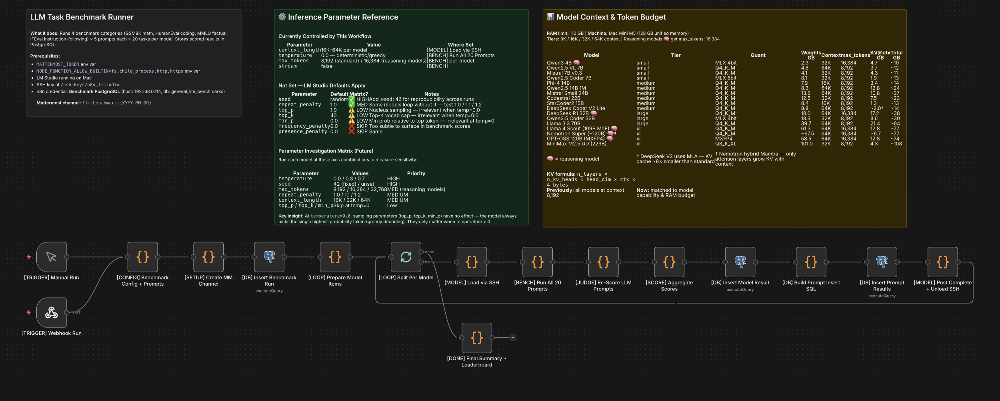
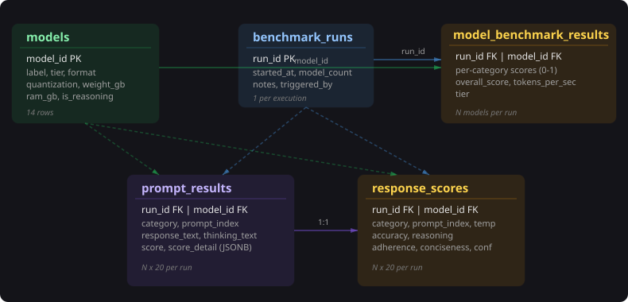
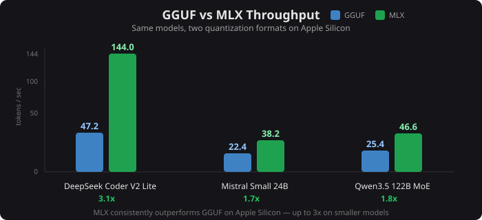

## Abstract

The M5 Max MacBook Pro with 128 GB of unified memory represents a new tier of consumer hardware for local LLM inference. This project presents an automated benchmarking pipeline that evaluated 14 models across four categories (GSM8K, HumanEval, MMLU, IFEval) in both GGUF and MLX formats where available, using two-layer scoring — deterministic automated validation combined with independent five-dimension rubric review. Across over 2,400 scored prompt runs at three temperatures, the top performers — Qwen3.5 122B MoE (1.00 rubric average), Nemotron Super ~120B and MiniMax M2.5 229B (MLX) (each 0.98) — demonstrated strong results from quantized local inference, while Qwen2.5 VL 7B delivered 0.90 accuracy at 69.8 tokens/second — 3x faster than comparably accurate models at a fraction of the parameter count.

## Introduction

Consumer Apple Silicon hardware can now run large language models locally with meaningful throughput. The M5 Max MacBook Pro with 128 GB of unified memory supports models up to 229 billion parameters via quantized inference in LM Studio. This project set out to answer a practical question: across a wide range of open-weight models, what accuracy and throughput can you actually expect from local inference on this hardware?

To test this systematically, the project uses an automated pipeline that:

1. Benchmarks local models across four established evaluation categories
2. Applies a two-layer scoring methodology separating deterministic validation from qualitative assessment
3. Stores all results in a normalized relational schema for longitudinal comparison
4. Runs end-to-end without manual intervention via workflow orchestration

The pipeline evaluated 14 models — 11 tested in both GGUF and MLX formats — ranging from 4.8 GB (Qwen2.5 VL 7B, Q4_K_M GGUF) to 101 GB (MiniMax M2.5 229B, Q3_K_XL GGUF) across four size tiers.

| Model | GGUF Quant | GGUF GB | GGUF Source | MLX Bits | MLX GB | MLX Source |
|-------|------------|---------|-------------|----------|--------|------------|
| MiniMax M2.5 229B | Q3_K_XL | 101.0 | MiniMax-M2.5-GGUF | 3-bit | 100.1 | mlx-community |
| Nemotron Super ~120B | Q4_K_M | 85.0 | lmstudio-community | — | — | — |
| Qwen3.5 122B MoE | Q4_K_S | 73.5 | unsloth | 4-bit | 69.6 | mlx-community |
| Llama 4 Scout 109B MoE | Q4_K_M | 61.3 | lmstudio-community | 4-bit | 61.1 | mlx-community |
| GPT-OSS 120B | MXFP4 | 58.5 | lmstudio-community | MXFP4 | 63.4 | mlx-community |
| Llama 3.3 70B | Q4_K_M | 39.7 | lmstudio-community | 4-bit | 39.7 | mlx-community |
| Qwen2.5 Coder 32B | — | — | — | 4-bit | 18.3 | mlx-community |
| DeepSeek R1 32B | Q4_K_M | 18.0 | lmstudio-community | 4-bit | 18.4 | mlx-community |
| Mistral Small 24B | Q4_K_M | 13.5 | lmstudio-community | 4-bit | 14.1 | mlx-community |
| Qwen2.5 14B 1M | Q4_K_M | 8.3 | lmstudio-community | 8-bit | 15.7 | mlx-community |
| DeepSeek Coder V2 Lite | Q4_K_M | 8.8 | lmstudio-community | 4-bit | 8.8 | mlx-community |
| Phi-4 14B | Q4_K_M | 7.9 | lmstudio-community | 4-bit | 8.3 | mlx-community |
| Qwen2.5 Coder 7B | — | — | — | 8-bit | 8.1 | mlx-community |
| Qwen2.5 VL 7B | Q4_K_M | 4.8 | lmstudio-community | 8-bit | 9.0 | mlx-community |

## Methodology

### Test Architecture

The pipeline is an n8n workflow running in Docker on an Unraid server, communicating with the M5 Max MacBook Pro over the local network via SSH and HTTP.

The workflow iterates through each model sequentially. For each model, it SSH-es into the M5 Max MacBook Pro to load the model via `lms load <model_id> --context-length N`, executes 20 prompts against LM Studio's OpenAI-compatible API (`/v1/chat/completions`), applies Layer 1 automated scoring (deterministic pass/fail), persists results to PostgreSQL, posts progress to Mattermost, and unloads the model via `lms unload --all` before proceeding to the next. After all models complete, a separate Layer 2 rubric review is performed by Claude (via API), scoring each stored response across five qualitative dimensions.

### Benchmark Selection

Four benchmark categories were selected to evaluate distinct capabilities relevant to practical local LLM usage:

| Category | Source | Capability Tested | Prompts |
|----------|--------|-------------------|---------|
| GSM8K | [Cobbe et al., 2021](https://arxiv.org/abs/2110.14168) | Multi-step mathematical reasoning | 5 |
| HumanEval | [Chen et al., 2021](https://arxiv.org/abs/2107.03374) | Python function completion | 5 |
| MMLU | [Hendrycks et al., 2021](https://arxiv.org/abs/2009.03300) | Broad factual knowledge (multiple choice) | 5 |
| IFEval | [Zhou et al., 2023](https://arxiv.org/abs/2311.07911) | Constraint-based instruction following | 5 |

Each category contributes 5 prompts for a total of 20 prompts per model per temperature setting. Prompts were drawn from the original benchmark datasets, selecting problems that are solvable within a single inference call and verifiable through deterministic automated scoring.

### Prompt Design

The exact prompts used in each category are listed below.

**GSM8K — Math Reasoning** (scoring: extract final number via regex, exact match)

| # | Prompt | Answer |
|---|--------|--------|
| 0 | Natalia sold clips to 48 of her friends in April, and then she sold half as many clips in May. How many clips did Natalia sell altogether in April and May? Let's think step by step. | 72 |
| 1 | Weng earns $12 an hour for babysitting. Yesterday, she just did 50 minutes of babysitting. How much did she earn? Let's think step by step. | 10 |
| 2 | Betty is saving money for a new wallet which costs $100. Betty has only half of the money she needs. Her parents decided to give her $15 for that purpose, and her grandparents twice as much as her parents. How much more money does Betty need to buy the wallet? Let's think step by step. | 5 |
| 3 | Julie is reading a 120-page book. Yesterday, she was able to read 12 pages and today, she read twice as many pages as yesterday. If she wants to read half of the remaining pages tomorrow, how many pages should she read? Let's think step by step. | 42 |
| 4 | James writes a 3-page letter to 2 different friends twice a week. How many pages does he write a year? Let's think step by step. | 624 |

**HumanEval — Python Code Completion** (scoring: execute against assert tests, or LLM judge fallback)

Each prompt uses the template: "Complete this Python function:" followed by the function signature and docstring.

| # | Function | Task |
|---|----------|------|
| 0 | `has_close_elements(` `numbers: List[float],` `threshold: float) -> bool` | Return True if any two numbers are closer than threshold |
| 1 | `separate_paren_groups(` `paren_string: str) -> List[str]` | Split balanced parenthesis groups into list |
| 2 | `truncate_number(` `number: float) -> float` | Return decimal part of positive float (3.5 → 0.5) |
| 3 | `below_zero(` `operations: List[int]) -> bool` | Return True if bank balance ever drops below zero |
| 4 | `mean_absolute_deviation(` `numbers: List[float]) -> float` | Calculate MAD around mean of input list |

**MMLU — Factual Knowledge** (scoring: extract letter A–D via regex, exact match)

Each prompt ends with "Answer with only the letter."

| # | Question | A | B | C | D | Answer |
|---|----------|---|---|---|---|--------|
| 0 | Term for gamete production by meiosis? | Gametogenesis | Oogenesis | Spermatogenesis | Sporogenesis | A |
| 1 | Best description of mitochondria function? | Protein synthesis | ATP via cellular respiration | DNA replication | Lipid synthesis | B |
| 2 | Charge of a proton? | -1 | 0 | +1 | +2 | C |
| 3 | Philosopher of the categorical imperative? | John Locke | David Hume | Immanuel Kant | John Stuart Mill | C |
| 4 | What does GDP stand for in economics? | Gross Domestic Product | General Debt Payment | Government Defense Policy | Gross Development Percentage | A |

**IFEval — Instruction Following** (scoring: constraint-specific automated check)

| # | Prompt | Constraint |
|---|--------|-----------|
| 0 | Write exactly 3 bullet points (each starting with "- ") about the benefits of regular exercise. Use no more than 20 words per bullet. | Exactly 3 lines matching `^- ` |
| 1 | Respond ONLY in ALL CAPS. Describe what a neural network is in 2-3 sentences. | Entire response uppercase |
| 2 | Write a response containing "innovation" at least 3 times and "future" at least 2 times. Topic: technology trends. | Keyword frequency thresholds |
| 3 | Respond with a valid JSON object with exactly these keys: "name", "age", "city". Use any reasonable values. | Valid JSON with required keys |
| 4 | Write between 50 and 60 words (inclusive) describing the water cycle. Count carefully. | Word count in [50, 60] |

The following table documents each pipeline file's role:

| File | Stage | Purpose |
|------|-------|---------|
| `prompts.md` | Runner | 20 prompts, expected answers, scoring method |
| `scoring-rubric.md` | Review | 5-dimension rubric definitions (1–3 scale) |
| `scoring-playbook.md` | Review | Review procedure, SQL queries, validation |
| `run-playbook.md` | Runner | Pre-flight checklist, config, post-run checks |
| `models.md` | Runner | Model registry (tier, format, quant, RAM) |
| `troubleshooting.md` | Ops | Failure modes, root causes, fixes |

Full prompt templates are available in the project repository (link coming soon).

### Scoring Framework

Each model response is scored twice through independent mechanisms.

**Layer 1 — Automated Validation.** The benchmark runner scores each response immediately using deterministic, category-specific methods:

| Category | Validation Method | Pass Criteria |
|----------|------------------|---------------|
| GSM8K | Numeric extraction (regex cascade) | Exact match to expected answer |
| HumanEval | Code execution + assert tests | All tests pass (fallback: LLM judge) |
| MMLU | Letter extraction (regex cascade) | Exact match to expected letter |
| IFEval | Constraint-specific checks (5 types) | All structural constraints satisfied |

All automated scores are binary: 1.00 (pass) or 0.00 (fail). Results are stored with category-specific `score_detail` JSON containing the extraction evidence.

**Layer 2 — Independent Rubric Review.** After all models have been evaluated and unloaded, a separate review process uses the Claude API to score every stored response across five qualitative dimensions on a 1–3 scale:

| Dimension | What It Measures | 3 = Excellent |
|-----------|-----------------|---------------|
| Accuracy | Correctness of final answer | Fully correct |
| Reasoning | Quality of intermediate steps | Complete, logical, correct |
| Adherence | Following prompt instructions | All instructions satisfied |
| Conciseness | Economy of response | No padding or repetition |
| Confidence | Clarity of answer delivery | Direct, no hedging |

Scores of 1 (poor) and 2 (adequate) are defined in the scoring rubric. Maximum: 15 points per prompt (5 dimensions x 3 points). Scores are aggregated per model as a normalized average (0.00–1.00) for cross-model comparison.

### Temperature Control

Three temperature settings were tested across separate workflow executions:

- **T=0.0** — Deterministic output for reproducibility baseline
- **T=0.3** — Low variance for practical use-case simulation
- **T=0.7** — Higher variance to assess robustness and creativity

Temperature is configured as a single parameter in the workflow's config node and applied uniformly to all 20 prompts within a run. Each temperature setting produces an independent set of results, enabling per-temperature analysis.

### Data Architecture

All results are persisted in PostgreSQL across five normalized tables:

| Table | One Row = | Purpose |
|-------|-----------|---------|
| `benchmark_runs` | One workflow execution | Run metadata, timestamps, model count |
| `model_benchmark_results` | One model in one run | Per-category scores, overall score, throughput |
| `prompt_results` | One prompt response | Raw response, automated score, score detail (JSONB) |
| `response_scores` | One rubric evaluation | Five dimension scores, total, reviewer notes |
| `models` | One model in catalog | Size, format, quantization, tier, RAM requirement |

The `prompt_results` table stores the model's raw response alongside the automated score and category-specific `score_detail` JSON. The `response_scores` table stores the independent rubric review. The `thinking_text` column in `prompt_results` captures extracted `<think>...</think>` blocks from reasoning models (11 of 14 models emit chain-of-thought), stored separately from the response text.

### Hardware Configuration

**Inference host:** M5 Max MacBook Pro, Apple M5 Max chip, 128 GB unified memory. Models served via LM Studio's OpenAI-compatible API on the local network.

**Orchestration host:** Unraid server running n8n v2.37.4 (Docker), PostgreSQL 16, and Mattermost (notifications).

**Network:** SSH over the local network for model load/unload commands. HTTP for inference API calls. SSH key authentication with the key mounted in the n8n container.

## Results

The pipeline evaluated 14 models across three temperatures — 11 in both GGUF and MLX formats — producing over 2,400 scored prompt responses. Results are presented below by inference format.

### Overall Performance

The top performers were Qwen3.5 122B MoE, which achieved a perfect 1.00 rubric average — scoring 15.0/15 across all four categories — followed by Nemotron Super ~120B and MiniMax M2.5 229B (MLX), each at 0.98.

The efficiency standout was Qwen2.5 VL 7B (GGUF Q4_K_M), which achieved 0.90 rubric accuracy at 69.8 tokens/second with a 4.8 GB model file — 3x faster than Mistral Small 24B at the same accuracy level, using one-third the disk space.

**GGUF Models** (sorted by rubric average):

| Model | GB | Quant | tok/s | Avg | Best |
|-------|----|-------|-------|-----|------|
| Qwen3.5 122B MoE | 73.5 | Q4_K_S | 31.7 | 1.00 | All |
| Nemotron Super ~120B | 85.0 | Q4_K_M | 27.6 | 0.98 | GSM8K |
| MiniMax M2.5 229B | 101.0 | Q3_K_XL | 38.3 | 0.98 | MMLU |
| GPT-OSS 120B | 58.5 | MXFP4 | 65.9 | 0.95 | IFEval |
| Llama 4 Scout 109B MoE | 61.3 | Q4_K_M | 24.3 | 0.93 | GSM8K |
| Qwen2.5 VL 7B | 4.8 | Q4_K_M | 69.8 | 0.90 | HumanEval |
| Mistral Small 24B | 13.5 | Q4_K_M | 22.4 | 0.90 | GSM8K |
| DeepSeek R1 32B | 18.0 | Q4_K_M | 15.8 | 0.88 | GSM8K |
| Qwen2.5 14B 1M | 8.3 | Q4_K_M | 36.5 | 0.88 | GSM8K |
| Phi-4 14B | 7.9 | Q4_K_M | 35.7 | 0.88 | GSM8K |
| Llama 3.3 70B | 39.7 | Q4_K_M | 7.5 | 0.86 | GSM8K |
| DeepSeek Coder V2 Lite | 8.8 | Q4_K_M | 127.1 | 0.82 | GSM8K |

**MLX Models** (sorted by rubric average):

| Model | GB | Bits | tok/s | Avg | Best |
|-------|----|------|-------|-----|------|
| Qwen3.5 122B MoE | 69.6 | 4-bit | 43.7 | 1.00 | All |
| MiniMax M2.5 229B | 100.1 | 3-bit | 45.7 | 0.98 | GSM8K |
| GPT-OSS 120B | 63.4 | MXFP4 | 63.6 | 0.98 | GSM8K |
| DeepSeek R1 32B | 18.4 | 4-bit | 12.5 | 0.91 | HumanEval |
| Qwen2.5 Coder 32B | 18.3 | 4-bit | 19.4 | 0.91 | GSM8K |
| Qwen2.5 14B 1M | 15.7 | 8-bit | 26.6 | 0.91 | MMLU |
| Qwen2.5 VL 7B | 9.0 | 8-bit | 38.1 | 0.91 | HumanEval |
| Llama 3.3 70B | 39.7 | 4-bit | 9.0 | 0.90 | MMLU |
| Llama 4 Scout 109B MoE | 61.1 | 4-bit | 21.6 | 0.90 | GSM8K |
| Mistral Small 24B | 14.1 | 4-bit | 28.0 | 0.88 | GSM8K |
| Phi-4 14B | 8.3 | 4-bit | 43.1 | 0.87 | GSM8K |
| DeepSeek Coder V2 Lite | 8.8 | 4-bit | 144.0 | 0.85 | HumanEval |
| Qwen2.5 Coder 7B | 8.1 | 8-bit | 54.0 | 0.83 | GSM8K |

### Per-Category Leaders

| Category | Leader | Score | Runner-up | Score |
|----------|--------|-------|-----------|-------|
| GSM8K | Qwen3.5 122B MoE (GGUF) | 1.00 | Llama 4 Scout, Nemotron, MiniMax (MLX) | 1.00 |
| HumanEval | Qwen3.5 122B MoE (GGUF) | 1.00 | Nemotron Super ~120B | 0.99 |
| MMLU | Qwen3.5 MoE, Nemotron, MiniMax, GPT-OSS | 1.00 | Qwen2.5 14B 1M, VL 7B (MLX) | 0.93 |
| IFEval | Qwen3.5 122B MoE (MLX) | 1.00 | GPT-OSS 120B (both) | 0.99 |

### Speed-Accuracy Tradeoff

Model performance spans from 4.8 GB / 69.8 tokens/second (Qwen2.5 VL 7B, 0.90 rubric average) to 101 GB / 38.3 tokens/second (MiniMax M2.5 229B). The relationship between model size and accuracy is not linear — Qwen2.5 Coder 32B (18.3 GB, 0.91 accuracy) outperformed Llama 3.3 70B (39.7 GB, 0.86 accuracy) while running 2.6x faster.

### Format Comparison: GGUF vs MLX

Eleven models were tested in both GGUF and MLX quantizations. MLX variants achieved higher throughput in most cases, though the advantage varied by model and was not universal.

| Model | GGUF tok/s | MLX tok/s | Speedup | Accuracy (GGUF → MLX) |
|-------|------------|-----------|---------|----------------------|
| Qwen3.5 122B MoE | 31.7 | 43.7 | +38% | 1.00 → 1.00 |
| MiniMax M2.5 229B | 38.3 | 45.7 | +19% | 0.98 → 0.98 |
| DeepSeek Coder V2 Lite | 127.1 | 144.0 | +13% | 0.82 → 0.85 |
| Mistral Small 24B | 22.4 | 28.0 | +25% | 0.90 → 0.88 |
| Phi-4 14B | 35.7 | 43.1 | +21% | 0.88 → 0.87 |
| Llama 3.3 70B | 7.5 | 9.0 | +20% | 0.86 → 0.90 |
| GPT-OSS 120B | 65.9 | 63.6 | -3% | 0.95 → 0.98 |
| Qwen2.5 VL 7B | 69.8 | 38.1 | -45% | 0.90 → 0.91 |
| Qwen2.5 14B 1M | 36.5 | 26.6 | -27% | 0.88 → 0.91 |
| DeepSeek R1 32B | 15.8 | 12.5 | -21% | 0.88 → 0.91 |
| Llama 4 Scout 109B MoE | 24.3 | 21.6 | -11% | 0.93 → 0.90 |

Notable: MLX was faster for 6 of 11 models (up to +38% for Qwen3.5 122B MoE). However, GGUF Q4_K_M outperformed MLX 4-bit/8-bit for Qwen2.5 VL 7B (-45%), Qwen2.5 14B 1M (-27%), DeepSeek R1 32B (-21%), and Llama 4 Scout (-11%). The throughput advantage appears format- and architecture-dependent rather than universal.

## Discussion

### Two-Layer Scoring

The two-layer scoring methodology proved essential. Automated validation alone would have rated several models higher than their actual reasoning quality warranted. The rubric review caught cases where a model produced a correct final answer through flawed intermediate reasoning — the automated layer scored these as passing, but the rubric review penalized reasoning quality. This separation provides a more accurate picture of model capability than either layer alone.

### Orchestration

n8n proved surprisingly capable as an ML evaluation orchestration engine. JavaScript Code nodes handled HTTP calls, SSH commands, regex scoring, and SQL construction within a single workflow. The primary limitation was debugging complexity — a 14-node workflow with SSH connections, HTTP calls, and PostgreSQL writes produces failure modes that are difficult to trace through n8n's visual interface. The most fragile component was SSH-based model loading. Timing issues, stale connections, and LM Studio CLI hangs required defensive error handling (connectivity probes via `nc -z -w 3`, explicit unload-before-load sequences) that accounted for more development time than any other pipeline component.

### Data Persistence

Storing results in PostgreSQL rather than flat files transformed the project from a one-off experiment into a reusable evaluation system. Ad-hoc queries like "fastest model above 80% accuracy" or "best performer under 10 GB" are trivial SQL. The normalized schema (runs → model results → prompt results → rubric scores) supports longitudinal comparison as new models are released without any schema changes.

### Limitations

This evaluation has several constraints. All inference ran on a single machine (M5 Max MacBook Pro, 128 GB unified memory), limiting the maximum model size to approximately 108 GB RAM. Quantized models (4-bit, 3-bit) were tested rather than full-precision weights, which may affect accuracy relative to published benchmarks. The prompt set (20 per model) is small compared to full benchmark suites (GSM8K contains 8,792 problems; HumanEval contains 164). Results reflect local inference characteristics and are not directly comparable to cloud-hosted evaluations.

### Future Work

Planned extensions include automated re-runs triggered by new model releases (via n8n webhook + LM Studio model registry polling), expansion of the prompt set to 50+ per category, addition of multi-turn conversation benchmarks, and a web dashboard for interactive result exploration built on the existing PostgreSQL schema. 

## References

1. Cobbe, K., Kosaraju, V., Bavarian, M., Chen, M., Jun, H., Kaiser, L., Plappert, M., Tworek, J., Hilton, J., Nakano, R., Hesse, C., & Schulman, J. (2021). Training Verifiers to Solve Math Word Problems. *arXiv preprint arXiv:2110.14168*. [https://arxiv.org/abs/2110.14168](https://arxiv.org/abs/2110.14168)

2. Chen, M., Tworek, J., Jun, H., Yuan, Q., Pinto, H. P. de O., Kaplan, J., Edwards, H., Burda, Y., Joseph, N., Brockman, G., Ray, A., Puri, R., Krueger, G., Petrov, M., Khlaaf, H., Sastry, G., Mishkin, P., Chan, B., Gray, S., … Zaremba, W. (2021). Evaluating Large Language Models Trained on Code. *arXiv preprint arXiv:2107.03374*. [https://arxiv.org/abs/2107.03374](https://arxiv.org/abs/2107.03374)

3. Hendrycks, D., Burns, C., Basart, S., Zou, A., Mazeika, M., Song, D., & Steinhardt, J. (2021). Measuring Massive Multitask Language Understanding. *Proceedings of the International Conference on Learning Representations (ICLR)*. [https://arxiv.org/abs/2009.03300](https://arxiv.org/abs/2009.03300)

4. Zhou, J., Lu, T., Mishra, S., Brahma, S., Basu, S., Liang, Y., Zhong, Q., Blume, C., Li, X., Li, T., Rawat, A. S., Vashishth, S., Dey, K., He, H., Cho, K., & Sil, A. (2023). Instruction-Following Evaluation for Large Language Models. *arXiv preprint arXiv:2311.07911*. [https://arxiv.org/abs/2311.07911](https://arxiv.org/abs/2311.07911)

5. LM Studio. Local LLM inference engine with OpenAI-compatible API. [https://lmstudio.ai](https://lmstudio.ai)

6. n8n. Workflow automation platform. [https://n8n.io](https://n8n.io)
