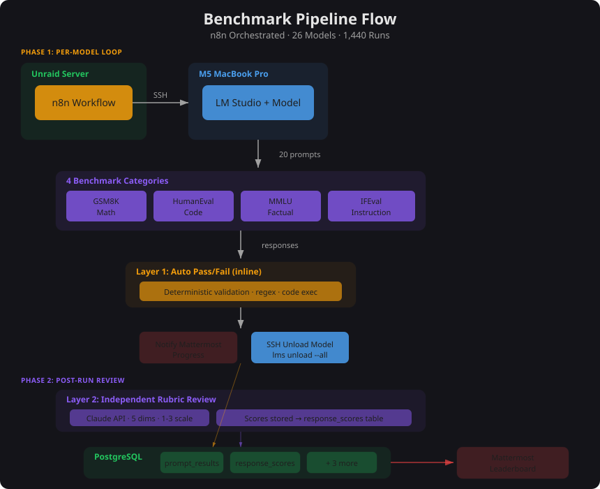
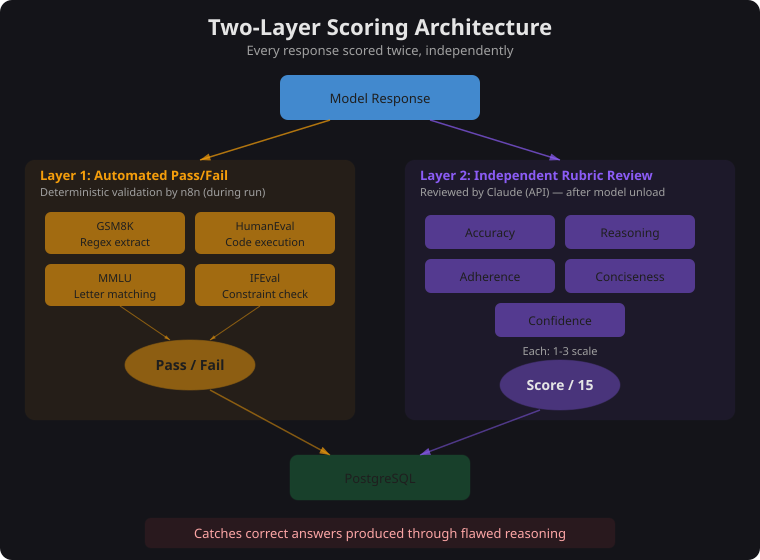
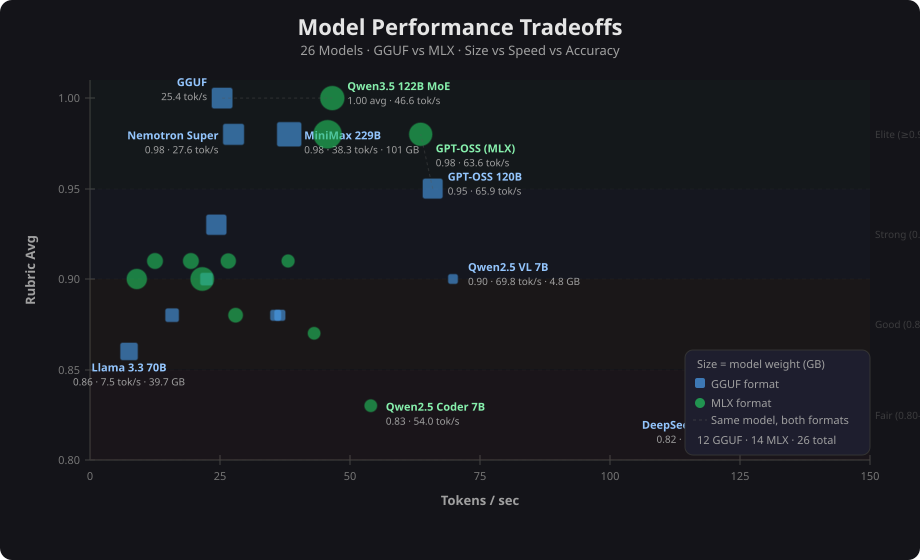

## Abstract

Local large language model inference on Apple Silicon lacks a structured evaluation framework comparable to cloud-hosted benchmarks such as LMSYS Chatbot Arena or the Open LLM Leaderboard. This project presents an automated benchmarking pipeline that evaluated 26 local LLMs across four established benchmark categories — GSM8K, HumanEval, MMLU, and IFEval — using a two-layer scoring methodology combining deterministic automated validation with independent five-dimension rubric review. The pipeline executed 1,440 scored prompt runs across three temperature settings (T=0.0, T=0.3, T=0.7) on an M5 MacBook Pro with 128 GB unified memory, with all results persisted in a normalized PostgreSQL schema. The top-performing model, Qwen3.5 122B MoE, achieved a perfect 1.00 rubric average across all categories, while Qwen2.5 VL 7B emerged as the efficiency standout at 0.90 accuracy and 69.8 tokens/second — 3x faster than comparably accurate models at a fraction of the parameter count.

## Introduction

Consumer Apple Silicon hardware can now run large language models locally with meaningful throughput. The M5 MacBook Pro with 128 GB of unified memory supports models up to 229 billion parameters via quantized inference in LM Studio. However, no standardized methodology exists for comparing these models in a local inference context. Existing public benchmarks — [LMSYS Chatbot Arena](https://chat.lmsys.org/), [Open LLM Leaderboard](https://huggingface.co/spaces/open-llm-leaderboard/open_llm_leaderboard) — evaluate cloud-hosted, full-precision models under conditions that do not reflect local quantized inference on consumer hardware.

This project addresses that gap with an automated, reproducible pipeline that:

1. Benchmarks local models across four established evaluation categories
2. Applies a two-layer scoring methodology separating deterministic validation from qualitative assessment
3. Stores all results in a normalized relational schema for longitudinal comparison
4. Runs end-to-end without manual intervention via workflow orchestration

The pipeline evaluated 26 models ranging from 2.3 GB (Qwen3 4B, 4-bit MLX) to 101 GB (MiniMax M2.5 229B, Q3_K_XL GGUF), spanning four size tiers and two inference formats (GGUF and MLX).

## Methodology

### Test Harness Architecture

The pipeline consists of two n8n workflows running in Docker on an Unraid server, communicating with the MacBook Pro over the local network via SSH and HTTP.

**Workflow 1 — Benchmark Runner** (n8n ID: `zIioQ1lVRioqvFTA`, 14 nodes): Iterates through each model sequentially. For each model, the workflow SSH-es into the MacBook Pro to load the model via `lms load <model_id> --context-length N`, executes 20 prompts against LM Studio's OpenAI-compatible API (`/v1/chat/completions`), scores each response, persists results to PostgreSQL, posts progress to Mattermost, and unloads the model via `lms unload --all` before proceeding to the next.

**Workflow 2 — Documentation Generator** (n8n ID: `XctfvBlnc2BYlViz`): Clones a Gitea repository, runs five sequential LLM sessions per model (file tree analysis, core architecture, component interfaces, README generation, LLM context file), and auto-commits output to per-model branches (`docs/benchmark-{model-slug}-{YYYY-MM-DD}`). This serves as both a documentation tool and a real-world benchmark of structured code reasoning.

### Benchmark Selection

Four benchmark categories were selected to evaluate distinct capabilities relevant to practical local LLM usage:

| Category | Source | Capability Tested | Prompts |
|----------|--------|-------------------|---------|
| GSM8K | [Cobbe et al., 2021](https://arxiv.org/abs/2110.14168) | Multi-step mathematical reasoning | 5 |
| HumanEval | [Chen et al., 2021](https://arxiv.org/abs/2107.03374) | Python function completion | 5 |
| MMLU | [Hendrycks et al., 2021](https://arxiv.org/abs/2009.03300) | Broad factual knowledge (multiple choice) | 5 |
| IFEval | [Zhou et al., 2023](https://arxiv.org/abs/2311.07911) | Constraint-based instruction following | 5 |

Each category contributes 5 prompts for a total of 20 prompts per model per temperature setting. Prompts were drawn from the original benchmark datasets, selecting problems that are solvable within a single inference call and verifiable through deterministic automated scoring.

### Prompt Design

GSM8K prompts are multi-step arithmetic word problems appended with "Let's think step by step." to elicit chain-of-thought reasoning. Expected answers are exact integers (e.g., 72, 624). HumanEval prompts present a function signature with docstring and require the model to complete the implementation. MMLU prompts present a question with four lettered options (A–D) and instruct the model to "Answer with only the letter." IFEval prompts impose specific structural constraints: exact bullet count, all-caps response, keyword frequency minimums, valid JSON with required keys, or word count within a specified range.

The full prompt templates are maintained in the project repository. The following table documents each prompt file's role in the pipeline:

| File | Pipeline Stage | Purpose |
|------|---------------|---------|
| `benchmark/prompts.md` | Benchmark Runner | Contains all 20 prompt texts with expected answers and scoring method per category |
| `benchmark/scoring-rubric.md` | Independent Review | Defines the five-dimension rubric (1–3 scale) with per-category scoring guidance |
| `benchmark/scoring-playbook.md` | Independent Review | Step-by-step procedure for conducting rubric reviews, including SQL queries and validation |
| `benchmark/run-playbook.md` | Benchmark Runner | Pre-flight checklist, configuration parameters, post-run validation steps |
| `benchmark/models.md` | Benchmark Runner | Complete model registry with tier, format, quantization, context length, and RAM requirements |
| `benchmark/troubleshooting.md` | Operations | Known failure modes, root causes, and fixes (SSH, scoring edge cases, credential rotation) |

Full prompt templates are available in the [repository link].

### Scoring Framework

Each model response is scored twice through independent mechanisms.

**Layer 1 — Automated Validation.** The benchmark runner workflow scores each response immediately using deterministic, category-specific methods:

| Category | Method | Pass Criteria |
|----------|--------|---------------|
| GSM8K | Regex extraction: `ANSWER:\s*([\d.]+)`, `####\s*([\d.]+)`, or last numeric token | Extracted number matches expected answer exactly |
| HumanEval | Code execution via `python3` against assert tests; fallback to LLM judge with full token budget (16,384) if python3 unavailable | All assertions pass, or judge verdict contains "PASS" |
| MMLU | Letter extraction: primary `^([ABCD])`, intermediate `ANSWER:\s*([ABCD])`, fallback `\b([ABCD])\b` | Extracted letter matches expected answer |
| IFEval P0 | Count lines matching `^- ` regex | Exactly 3 |
| IFEval P1 | `response === response.toUpperCase()` | True (no lowercase characters) |
| IFEval P2 | Count occurrences of "innovation" and "future" | "innovation" >= 3, "future" >= 2 |
| IFEval P3 | `JSON.parse()` + key validation | Valid JSON containing keys "name", "age", "city" |
| IFEval P4 | `response.split(/\s+/).length` | Word count in range [50, 60] |

All automated scores are binary: 1.00 (pass) or 0.00 (fail). Results are stored with category-specific `score_detail` JSON containing the extraction evidence (expected value, extracted value, truncation flag, character count).

**Layer 2 — Independent Rubric Review.** After each benchmark run completes, a separate review process scores every response across five qualitative dimensions on a 1–3 scale:

| Dimension | Score 1 (Poor) | Score 2 (Adequate) | Score 3 (Excellent) |
|-----------|----------------|--------------------|--------------------|
| **Accuracy** | Wrong answer or no answer | Partially correct; right approach, wrong result | Fully correct |
| **Reasoning** | No reasoning, or reasoning contradicts answer | Reasoning present but has gaps or errors | Clear, correct, logically complete |
| **Instruction Adherence** | Ignored key instructions (wrong format, different question) | Followed partially with minor deviations | Fully adhered to all instructions |
| **Conciseness** | Excessively verbose (padding, repetition, restates question) | Somewhat verbose but core answer present | Appropriately concise |
| **Confidence** | Refuses to answer or hedges so heavily answer is unclear | Answer present but buried in caveats | Answer stated clearly and directly |

Maximum score per prompt: 15 (5 dimensions x 3 points). Scores are aggregated per model as a normalized average (0.00–1.00) for cross-model comparison. The rubric includes per-category guidance — for example, IFEval weights instruction adherence as the primary dimension, while HumanEval evaluates accuracy based on whether code passes documented test cases.

### Temperature Control

Three temperature settings were tested across separate workflow executions:

- **T=0.0** — Deterministic output for reproducibility baseline
- **T=0.3** — Low variance for practical use-case simulation
- **T=0.7** — Higher variance to assess robustness and creativity

Temperature is configured as a single parameter in the workflow's `[CONFIG]` node and applied uniformly to all 20 prompts within a run. Each temperature setting produces an independent set of `prompt_results` and `response_scores` rows, enabling per-temperature analysis.

### Data Architecture

All results are persisted in a PostgreSQL instance (`general_llm_benchmarks` database) across five normalized tables:

| Table | Granularity | Key Columns | Row Count (per run) |
|-------|-------------|-------------|-------------------|
| `benchmark_runs` | Per workflow execution | `run_id`, `started_at`, `model_count`, `notes`, `triggered_by` | 1 |
| `model_benchmark_results` | Per model per run | `run_id`, `model_id`, `tier`, per-category scores (0.0–1.0), `overall_score`, `tokens_per_sec` | N models |
| `prompt_results` | Per model x prompt per run | `run_id`, `model_id`, `category`, `prompt_index`, `response_text`, `thinking_text`, `score`, `score_detail` (JSONB) | N x 20 |
| `response_scores` | Per model x prompt x temperature | `run_id`, `model_id`, `category`, `prompt_index`, `temperature`, 5 rubric dimensions, `total`, `notes` | N x 20 |
| `models` | Catalog | `model_id`, `label`, `tier`, `format`, `quantization`, `context_length`, `is_reasoning`, `weight_gb`, `ram_gb`, `active` | 26 |

The `prompt_results` table stores the model's raw response alongside the automated score and category-specific `score_detail` JSON. The `response_scores` table stores the independent rubric review. The `thinking_text` column in `prompt_results` captures extracted `<think>...</think>` blocks from reasoning models (11 of 26 models emit chain-of-thought), stored separately from the response text.

### Hardware Configuration

**Inference host:** M5 MacBook Pro, Apple M5 chip, 128 GB unified memory. Models served via LM Studio's OpenAI-compatible API at `192.168.0.187:1234`.

**Orchestration host:** Unraid server at `REDACTED_IP` running:
- n8n v2.37.4 (Docker container, `NODE_FUNCTION_ALLOW_BUILTIN=fs,child_process,http,https`)
- PostgreSQL 16 (port 5432)
- Mattermost (notifications at `mattermost.local.jmlab.net`)
- Gitea (repository hosting for documentation generator workflow)

**Network:** SSH over local network (port 22) for model load/unload commands. HTTP for inference API calls. SSH key authentication with key mounted at `/ssh-keys/n8n_lmstudio` in the n8n container.

## Results

The Stage 1 evaluation covered 17 models across three temperatures, producing 1,020 scored prompt responses with independent rubric review. The full pipeline (Stage 1 + Stage 2) evaluated 26 models with 1,440 total scored executions.

### Overall Performance

The top two performers were both variants of Qwen3.5 122B MoE — a mixture-of-experts reasoning model with only 10B active parameters per forward pass. Both the GGUF (Q4_K_S) and MLX (4-bit) quantizations achieved a perfect 1.00 rubric average, scoring 15.0/15 across all four categories. The MLX variant ran at 46.6 tokens/second while the GGUF variant achieved 25.4 tokens/second.

The efficiency standout was Qwen2.5 VL 7B (GGUF Q4_K_M), which achieved 0.90 rubric accuracy at 69.8 tokens/second with a 4.8 GB model file — 3x faster than Mistral Small 24B at the same accuracy level, using one-third the disk space.

### Per-Category Leaders

| Category | Top Model(s) | Score | Notable |
|----------|-------------|-------|---------|
| GSM8K (math) | Phi-4 14B, Qwen3.5 122B (both), Llama 3.3 70B | 0.99–1.00 | Four-way tie; math reasoning broadly strong across sizes |
| HumanEval (coding) | Qwen3.5 122B MoE (both variants) | 1.00 | Only models to achieve perfect coding scores |
| MMLU (factual) | Qwen3.5 122B MoE (both variants) | 1.00 | Perfect factual knowledge across all temperatures |
| IFEval (instruction) | Qwen3.5 122B MoE (both variants) | 1.00 | Constraint satisfaction was the hardest category overall |

### Speed-Accuracy Tradeoff

Model performance spans from 2.3 GB / 145.5 tokens/second (Qwen3 4B, 0.69 rubric average) to 101 GB / 46 tokens/second (MiniMax M2.5 229B). The relationship between model size and accuracy is not linear — Qwen2.5 Coder 32B (18.3 GB, 0.91 accuracy) outperformed Llama 3.3 70B (39.7 GB, 0.86 accuracy) while running 2.5x faster.

### Format Comparison: GGUF vs MLX

Several models were tested in both GGUF and MLX quantizations. MLX variants consistently achieved higher throughput on Apple Silicon. Mistral Small 24B ran at 22.4 t/s (GGUF Q4_K_M) versus 38.2 t/s (MLX 4-bit) — a 70% speed improvement with equivalent accuracy. DeepSeek Coder V2 Lite showed a similar pattern: 47.2 t/s (GGUF) versus 144.0 t/s (MLX) — a 3x throughput gain.

### Archived Models

Four models were removed during evaluation: Mistral 7B Instruct v0.3 and StarCoder2 15B (empty responses on all prompts), Codestral 22B (LM Studio connection timeout on all prompts in both GGUF and MLX variants).

## Discussion

### Two-Layer Scoring

The two-layer scoring methodology proved essential. Automated validation alone would have rated several models higher than their actual reasoning quality warranted. The rubric review caught cases where a model produced a correct final answer through flawed intermediate reasoning — the automated layer scored these as passing, but the rubric review penalized reasoning quality. This separation provides a more accurate picture of model capability than either layer alone.

### Orchestration

n8n proved surprisingly capable as an ML evaluation orchestration engine. JavaScript Code nodes handled HTTP calls, SSH commands, regex scoring, and SQL construction within a single workflow. The primary limitation was debugging complexity — a 14-node workflow with SSH connections, HTTP calls to LM Studio, and PostgreSQL writes produces failure modes that are difficult to trace through n8n's visual interface. The most fragile component was SSH-based model loading. Timing issues, stale connections, and LM Studio CLI hangs required defensive error handling (connectivity probes via `nc -z -w 3`, explicit unload-before-load sequences) that accounted for more development time than any other pipeline component.

### Data Persistence

Storing results in PostgreSQL rather than flat files transformed the project from a one-off experiment into a reusable evaluation system. Ad-hoc queries like "fastest model above 80% accuracy" or "best performer under 10 GB" are trivial SQL. The normalized schema (runs → model results → prompt results → rubric scores) supports longitudinal comparison as new models are released without any schema changes.

### Limitations

This evaluation has several constraints. All inference ran on a single machine (M5 MacBook Pro, 128 GB unified memory), limiting the maximum model size to approximately 108 GB RAM. Quantized models (4-bit, 3-bit) were tested rather than full-precision weights, which may affect accuracy relative to published benchmarks. The prompt set (20 per model) is small compared to full benchmark suites (GSM8K contains 8,792 problems; HumanEval contains 164). Results reflect local inference characteristics and are not directly comparable to cloud-hosted evaluations.

### Future Work

Planned extensions include automated re-runs triggered by new model releases (via n8n webhook + LM Studio model registry polling), expansion of the prompt set to 50+ per category, addition of multi-turn conversation benchmarks, and a web dashboard for interactive result exploration built on the existing PostgreSQL schema.
